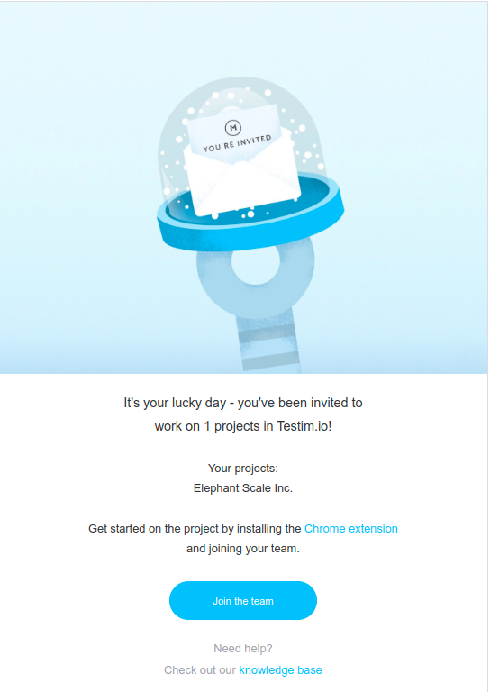
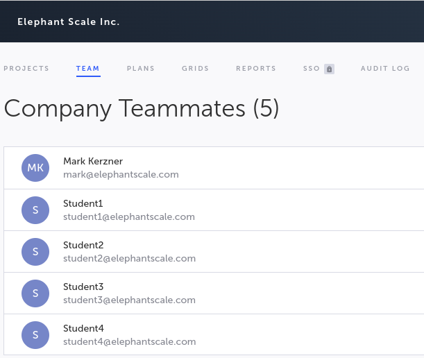

# Learn to use Testim

* [Testim site](https://www.testim.io/)
* [Testim education](https://www.testim.io/education/)
* [Testim documentation](https://help.testim.io/docs)
* [Testim about](https://www.testim.io/about/)
* => [Demo site for tests](https://demo.testim.io/)

### Step 1 Join the team

* Usually, you get an email

* Get started on the project by installing the [Chrome extension](https://mandrillapp.com/track/click/30759299/chrome.google.com?p=eyJzIjoidmNuTlo2aXJjQi1OanZ5em1hRmU1dDhUMHNFIiwidiI6MSwicCI6IntcInVcIjozMDc1OTI5OSxcInZcIjoxLFwidXJsXCI6XCJodHRwczpcXFwvXFxcL2Nocm9tZS5nb29nbGUuY29tXFxcL3dlYnN0b3JlXFxcL2RldGFpbFxcXC90ZXN0aW0tZWRpdG9yXFxcL3BlYmVpb29pbHBoZm1ib2hkYmhib21vbWtrb2dob2lhXCIsXCJpZFwiOlwiNmRmNDY5NGMzMzg2NGVkZWE3NDZjMzVmODE2M2Q4ZWRcIixcInVybF9pZHNcIjpbXCI3YmRjM2EzMjcxYjk5NDFmYWM1YjI3OWFhYzRiZGM5ODZjZWE3NTQzXCJdfSJ9) 
and joining your team.

* But in this case, we have already prepared the accounts

### Step 2

* Log in with the credentials assigned to you by the instructor.
  * Verify that you see the common projects, the team, etc.

### Step 3 - Overview of training

* [About testim training](https://www.testim.io/courses/testim-ai-certification-course/)

### Learn about using Testim

* [Introduction to Testim](https://www.testim.io/lessons/section-1-intro-to-testim/)

### Step 4 - Students create their own tests

